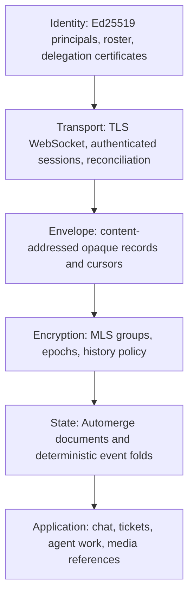

# Weald Relay Protocol

**Protocol identifier:** `weald-relay`  
**Current protocol version:** `1`  
**Status:** Production specification  
**Normative language:** The key words **MUST**, **MUST NOT**, **REQUIRED**, **SHALL**, **SHALL NOT**, **SHOULD**, **SHOULD NOT**, **RECOMMENDED**, **NOT RECOMMENDED**, **MAY**, and **OPTIONAL** in this document are to be interpreted as described in RFC 2119 and RFC 8174.

## 1. Executive statement

The Weald Relay Protocol is a local-first, end-to-end encrypted synchronization
protocol for collaborative project state: conversations, tickets, documents,
agent activity, and encrypted media references.

It is designed for teams that need all of the following at once:

- sub-second synchronization for connected members;
- complete local replicas that remain useful offline;
- cryptographically attributable writes;
- encrypted group membership and content delivery;
- an operator that can route and retain ciphertext but cannot read workspace
  content; and
- a durable, human-readable Git archive when a workspace elects to maintain one.

The protocol does not invent cryptographic primitives. It composes standardized
and independently implemented components: Messaging Layer Security (MLS),
Ed25519 signatures, BLAKE3 content addressing, deterministic CBOR, Automerge
documents, TLS, and range-based set reconciliation. The Weald-specific protocol
defines how those components are bound into a secure, operable collaboration
system.

**Primary security claim:** an operator running a conforming relay, including a
Weald-hosted relay, cannot decrypt message bodies, ticket text, document state,
or media plaintext. The relay processes opaque ciphertext and the minimum
metadata necessary to route it.

This claim does not mean the relay learns nothing. It can observe connection
metadata, ciphertext size, timing, opaque group identifiers, storage use, and
the frequency of activity and membership epochs. A compromised member device
can read data available to that member. Content intentionally sent by an agent
to a model provider leaves this boundary. These are protocol properties, not
exceptions hidden in implementation detail.

## 2. Scope and product model

One **workspace** is exactly one project:

- one `.weald` directory and durable project archive;
- one principal roster;
- one recovery phrase and recovery configuration;
- one relay authority; and
- one isolated set of local cryptographic and search state.

Teams using several projects operate several workspaces. There is no parent
organization object inside the protocol and no cross-workspace cryptographic
authority. Commercial accounts, billing organizations, SSO identities, and
control-plane roles are outside the protocol and MUST NOT grant access to
workspace content.

The protocol supports teams of roughly 3 to 30 people, with additional agent
identities acting through approved user devices. It is optimized for a small
number of concurrent writers, strong offline behavior, understandable recovery,
and inspectable operational behavior; it is not a federation protocol or a
consumer social network.

## 3. Architectural layers



The relay implements transport and envelope storage. It validates only public
envelope fields and authorization artifacts needed for admission. It does not
hold MLS epoch secrets, application signing keys, decrypted documents, or
plaintext search indexes.

Clients implement encryption, document state, local search, safety-number
verification, author-chain verification, and all user-visible security state.

## 4. Roles and trust boundaries

| Actor | Trust and authority |
| --- | --- |
| Principal | A human-controlled identity represented by one or more device keys. |
| Device | A principal-owned installation with a device signing key and MLS leaf. |
| Agent | A constrained delegated author. It is proxied by an approved device and never independently holds MLS state. |
| Workspace administrator | A principal authorized by the signed roster to manage invitations, groups, retention, and removal. |
| Relay operator | Stores and routes ciphertext. It is not trusted with content confidentiality or content integrity. |
| Control plane | Provisions, bills for, and monitors relays. It is not an identity provider for workspace content. |

No server-side identity, email address, billing record, or dashboard session is
proof of a workspace principal. The protocol's authority roots in cryptographic
keys, signed roster state, and the verified workspace genesis record.

## 5. Cryptographic profile

The following algorithms are mandatory for version 1:

| Function | Algorithm |
| --- | --- |
| Principal and device signatures | Ed25519 |
| Group encryption and membership | MLS 1.0 / RFC 9420, ciphersuite `0x0001` `MLS_128_DHKEMX25519_AES128GCM_SHA256_Ed25519`, exactly one, not negotiable |
| Application group state | MLS application messages |
| Envelope identifier | BLAKE3-256 |
| Key derivation where defined outside MLS | HKDF-SHA-256 |
| Wire serialization | Deterministic CBOR |
| Transport confidentiality | TLS 1.3 or later |

Version 1 pins one ciphersuite, one MLS protocol version, one credential type and
an empty set of Weald-defined MLS extensions. There is no ciphersuite negotiation
and no configuration field that selects one, because two implementations that can
negotiate can be steered into a combination nobody tested. A second ciphersuite,
a second credential type or any MLS extension is a protocol version change and
arrives through the version negotiation in `relay/wire.md`, never through a
capability flag or a deployment setting. The normative values, the interoperability
requirements that follow from them and the deprecation calendar are in
`relay/mls-binding.md`, section "The pinned cryptographic profile". How that pin
may change, and who may change it, is in `contracts/governance.md`.

Clients MUST use a maintained, version-pinned MLS implementation. The Weald MLS
binding is deliberately narrow: it creates and loads group state, creates and
processes MLS messages and commits, exports only derived material where the
protocol requires it, reports group epoch/tree hash, and securely frees state.
It MUST NOT expose raw epoch secrets to application code.

Private keys and MLS persistent state MUST be encrypted at rest with a
device-bound operating-system keystore key. The application MUST zero sensitive
buffers when its cryptographic provider permits it. Logs, crash reports,
analytics, and support bundles MUST NOT contain plaintext workspace content or
raw cryptographic key material.

## 6. Identity, roster, and delegation

### 6.1 Principal and device identity

Each principal has an Ed25519 root signing key and one or more device keys.
Device public keys, capabilities, enrollment state, and revocation state are
represented in the workspace roster. A device proves possession of its key
during session authentication and signs all authored protocol payloads.

The roster is a signed, versioned document. It establishes:

- principal identifiers and public keys;
- administrator and authorizer roles;
- device membership and key state;
- accepted recovery quorum configuration;
- agent delegation issuers; and
- the active roster version and prior-chain continuity.

Any roster transition MUST be signed by the authorizers required by the current
roster policy. A client MUST reject a transition that is unsigned, invalid,
forked, or not continuous from the previously verified roster state.

### 6.2 Agents

An agent is a delegated author, not an autonomous group member. Its certificate
MUST identify:

- issuer principal and issuing device;
- agent public key;
- workspace and permitted group identifiers;
- permitted event kinds and ticket transitions;
- issuance and expiry times;
- maximum lifetime; and
- revocation linkage.

Agent certificates are signed by their issuer. A proxying device verifies the
certificate before signing, encrypting, and publishing agent-authored payloads.
The agent's authority is bounded in scope and time. It MUST be removed from all
relevant MLS groups before or at certificate expiry, and it MUST NOT operate a
relay connection or retain independent MLS state.

### 6.3 Recovery

Every workspace has a mandatory recovery phrase. The phrase is not an operator
backdoor and does not allow the relay or control plane to decrypt content.
Recovery adds a probationary device or recovery principal; it does not silently
replace existing authority. A probationary recovery identity requires approval
from a pre-existing authorizer or the configured confirm-only recovery quorum
before it can exercise administrative authority.

## 7. MLS groups and history policy

Each synchronization scope is represented by an MLS group. The workspace root,
channels, direct messages, and restricted collaboration scopes MAY be separate
groups. A device can decrypt a scope only while it is a member of that scope's
MLS ratchet tree.

Membership changes MUST advance the MLS epoch. Removing a device or agent MUST
perform one coordinated operation that:

1. updates the signed roster and access set;
2. disconnects active relay sessions;
3. creates and distributes the MLS removal commit;
4. updates recovery wraps and retention manifests; and
5. produces a signed removal receipt visible to administrators.

MLS removal prevents a removed member from decrypting post-removal traffic. It
cannot erase plaintext or old epoch secrets already retained by a former
member. The client MUST communicate this distinction during removal and when a
workspace enables encrypted history.

Groups have one of two immutable-per-epoch history policies:

- **`closed`**: new members receive future state only. This is mandatory for
  direct messages and recommended for sensitive scopes.
- **`open`**: a joining member may receive approved historical epoch material
  and therefore historical content. It is the default for workspace-wide team
  channels.

Changing a history policy is an explicit, signed group transition and requires
an epoch change. A client MUST visibly display the active policy in the group
header and encryption panel.

## 8. Envelope protocol

The `Envelope` is the sole durable object stored by a relay. It is deterministic
CBOR and uses the following logical form:

```
Envelope {
  v:     u8,        // protocol version; v1 = 1
  enc:   u8,        // 1 = MLS; plaintext is not permitted on hosted relays
  group: bytes[32], // opaque group identifier
  epoch: u64,       // MLS epoch used to route the envelope
  seq:   u64,       // relay-assigned, advisory sync cursor
  ts:    u64,       // relay receipt time in Unix milliseconds, advisory
  hash:  bytes[32], // BLAKE3(v || enc || group || epoch || ct)
  ct:    bytes       // opaque MLS application message
}
```

The relay MUST validate the protocol version, configured encryption floor,
group existence, envelope hash, ciphertext size limit, and sender membership in
the current access set. The relay MUST reject plaintext envelopes when its
minimum encryption setting is MLS. Hosted relays MUST set that floor to MLS and
MUST NOT expose a configuration option that weakens it.

`seq` is a transport cursor only. Clients MUST NOT use it to resolve state,
establish causality, decide content integrity, or infer that a gap is data
loss. Relay sequence assignment is transactional per group. A duplicate content
hash returns its original cursor and MUST NOT consume another sequence number.

## 9. Encrypted payload and author chains

After MLS decryption, `ct` contains deterministic CBOR:

```
Payload {
  kind:      u16,
  author:    bytes[32],
  cert:      Certificate?,
  ctr:       u64,
  prev_self: bytes[32],
  sent_at:   u64,
  body:      bytes,
  sig:       bytes[64]
}
```

The `sig` is an Ed25519 signature over every preceding field in canonical order.
Clients MUST verify the author signature, certificate when present, allowed
event kind, group scope, monotonic counter, and predecessor hash before applying
the body to application state.

Each `(author, group)` pair maintains a dense, signed chain. `ctr` starts at
zero and increments by exactly one per payload; `prev_self` names the prior envelope hash for
that author in that group. Before publishing, clients persist the exact signed
envelope to a transactional outbox. After a crash or retry, they MUST resend the
same bytes rather than reusing the counter for different content.

This makes omission, reordering, and equivocation detectable by recipients.
The relay cannot forge an author link because it lacks the inner author key and
cannot decrypt the payload.

## 10. Split-view detection and transparency

Author chains detect a missing link only once a client has enough evidence.
They do not independently detect a relay serving consistent but different
histories to distinct clients. Weald therefore requires head attestation.

Every connected device MUST publish a signed `head.attest` event on connection
and at least once every fifteen minutes. The attestation names, for every held
group, the highest counter and matching hash observed for each author. Devices
also attest for agents that they proxy. Agents are never expected to be independent
attesters because they do not hold MLS state.

Clients derive the expected device attester set from their own MLS ratchet tree,
not from relay data. A disagreement, an unexplained chain gap, or a missing
attestation that persists for two reconciliation rounds MUST raise a visible
split-view warning. The warning MUST identify the relay, affected group, and
known absent or disagreeing authors. Silence is evidence; the protocol MUST NOT
report an incomplete set as healthy agreement.

Every membership transition is also recorded in a signed, hash-chained
membership transparency log beginning with the workspace genesis record. Clients
MUST verify continuity from the genesis fingerprint established during enrollment.

## 11. Access set and session admission

The relay needs enough information to reject revoked or unauthorized sessions,
but it must not learn the human-readable roster. Each group therefore has an
access set containing salted principal hashes and public authorization material
needed to validate connection admission. It is updated atomically with roster
and membership transitions.

On `CONNECT`, a client proves possession of its device key against a relay
challenge and presents the current access-set authorization chain. The relay
performs a signature check before allocating substantial state. It then permits
only the group operations allowed by that access set.

Access-set data is authorization metadata, not a content key. It MUST NOT be
used to derive MLS secrets, expose display names, or grant decryption. Recovery
wrap indexing is blinded and rotates per epoch so it cannot become a reusable
membership graph.

## 12. Synchronization and transport

Version 1 uses WebSocket over TLS. The application protocol is transport
agnostic: a future QUIC transport MAY carry the same frame set without changing
envelope, encryption, or application semantics.

The relay supports:

- authenticated session establishment;
- durable envelope send and idempotent acknowledgement;
- live push to eligible subscribers;
- range-based set reconciliation by envelope hash; and
- bounded range fetch using relay cursors as an optimization.

Clients MUST reconcile by content hash rather than relying exclusively on
relay sequence ranges. During dual transport, the same envelope may arrive from
Git and the relay; content addressing makes this idempotent. State convergence
is determined by the CRDT graph and verified author chains, never delivery
order.

The relay MUST apply bounded per-IP and per-connection admission limits,
bounded inbound and outbound queues, maximum frame and ciphertext sizes, and
explicit backpressure. A slow consumer MAY be downgraded from live push to
reconciliation. The relay MUST NOT silently drop durable envelopes; only
explicitly designated ephemeral events may be shed.

Errors MUST use stable classes:

| Class | Meaning | Required client response |
| --- | --- | --- |
| `retry` | transient infrastructure or backpressure | retry with jitter and resend identical bytes |
| `reject` | malformed or permanently invalid envelope | do not retry; preserve local diagnostic state |
| `denied` | authorization or current-state refusal | re-read named state; do not blindly retry |
| `quota` | exceeded storage, seat, or rate limit | surface the stated limit and retry only when allowed |
| `version` | incompatible protocol requirement | terminate the session and require update |

## 13. State model and application contract

Application state is represented by encrypted Automerge documents and
deterministic event folds. The protocol supports independent documents per
ticket, channel index, conversation, and other project entity. Application
schemas MUST be versioned and forward compatible; unknown optional fields are
preserved, and unsupported required capabilities fail visibly rather than being
discarded.

All application writes are local-first. A user may author state while offline;
the client validates it locally, persists it durably, encrypts it, and later
reconciles it. Concurrent valid writes merge according to the document's CRDT
semantics. Semantic conflicts that cannot be safely merged MUST be surfaced in
the application rather than hidden by transport ordering.

## 14. Git archive and migration behavior

Git remains a supported archive and offline transport tier. Existing Weald chat
and ticket files remain durable, human-readable project records. A workspace
MAY maintain an opt-in decrypted Git mirror from a designated plaintext-holding
device. That mirror is a deliberate security choice: anyone with repository
access can read mirrored plaintext.

The relay does not rewrite historical Git records or manufacture signatures for
legacy content. Existing unsigned content remains explicitly unverified. New
relay envelopes begin a new, visible history segment and may be rendered beside
legacy data according to application schema.

If the relay is unavailable, clients continue operating locally and reconcile
later through the relay or Git archive. A relay outage MUST NOT make a local
workspace unreadable or prevent locally authorized writes.

## 15. Media, retention, and deletion

Media is encrypted client-side before upload. The relay or object store receives
an opaque encrypted blob, content address, size, retention metadata, and the
minimum group association needed to authorize retrieval. It MUST NOT receive
plaintext filenames, previews, thumbnails, text extraction, or server-side
content indexing.

Deletion is implemented by removing retained ciphertext, advancing the relevant
group epoch, and publishing a signed retention transition. It prevents future
authorized retrieval from protocol storage. It cannot retract plaintext,
screenshots, backups, or historical epoch keys already held by a member.

Compaction is checkpoint-anchored. A client MUST verify signed checkpoint and
retention authorization before accepting `drop_before` behavior. A single
member, relay, or stale client MUST NOT be able to cause deletion of envelopes
or blobs without the configured authorization threshold.

## 16. Search, notifications, and telemetry

Search indexes are built locally from decrypted state. The relay MUST NOT offer
server-side full-text search, semantic search, moderation scanning, content
summaries, plaintext previews, or a support interface that reads content.

Version 1 notifications are local. Any future push service MUST carry only a
wake hint and a rotating opaque group alias; it MUST NOT carry message text,
ticket text, sender identity, channel name, or content-derived metadata.

Telemetry is aggregate and content-blind. Hosted deployments MUST disable
per-group metric labels. Debug logs MAY contain opaque identifiers only where
operationally necessary and MUST NOT include envelope bytes or decrypted data.

## 17. Operational requirements

A conforming relay is stateless with respect to content keys and is backed by a
transactional database plus encrypted object storage. It MUST provide:

- atomic group-local sequence assignment and envelope insertion;
- idempotent duplicate handling by content hash;
- encrypted backups with restoration drills;
- public liveness checks containing no sensitive diagnostics;
- authenticated readiness and administrative endpoints;
- reproducible builds, signed releases, and published artifact digests; and
- a self-hostable binary/container artifact that is identical in protocol
  behavior to the hosted relay.

The hosted tier MUST enforce MLS-only envelopes, access-set enforcement,
content-blind telemetry defaults, and no operator-held recovery/decryption key.
The control plane MAY start, stop, resize, meter, or delete a relay instance;
it MUST NOT impersonate a workspace principal or alter encrypted workspace
content.

## 18. Security verification requirements

No release is conforming merely because it compiles. The following are mandatory
release gates:

1. RFC 9420 test vectors and MLS interoperability tests pass through the
   production binding.
2. Property tests cover randomized membership churn, concurrent application
   messages, offline merge, removal, recovery, and group-history reachability.
3. Crash injection covers every transaction boundary between MLS state,
   application state, author-chain reservation, outbox persistence, and relay
   acknowledgement.
4. Fuzzing continuously exercises all untrusted frame, envelope, CBOR, MLS
   process, invitation, and recovery-input parsers.
5. Adversarial tests prove that revoked devices disconnect, cannot authenticate,
   and cannot decrypt post-removal epochs.
6. Tests demonstrate split-view warnings for both contradictory attestations
   and suppressed/missing attestations.
7. Independent security review covers the MLS binding, envelope semantics,
   authorization/access-set logic, recovery, retention, and operational
   deployment configuration. The complete report and remediation status are
   published.
8. Reproducible build verification proves that released relay artifacts match
   their published source and digest.

The client MUST surface these proofs as product state: relay digest match,
encryption floor, safety-number status, membership-log continuity, attestation
health, group history policy, and recovery probation. Security status MUST NOT
exist only in documentation or logs.

## 19. Threat model and non-goals

The protocol defends against a malicious or compromised relay attempting to
read content, forge authorship, replay durable writes, silently remove records,
or show different history to different clients. It also limits delegated agents
to explicit authority and expiry.

The protocol does not defend against:

- an endpoint compromise of a current authorized member;
- plaintext exported, screenshotted, or copied by an authorized member;
- content voluntarily sent to a third-party model provider;
- traffic analysis based on timing, size, or online presence;
- legal or organizational identity misrepresentation outside the verified key
  and invitation model; or
- recovery of data when every authorized client has irretrievably lost its keys.

The protocol is not a custom cipher, a generic identity system, a federated
social protocol, a server-side collaboration API, or an absolute deletion
mechanism. It intentionally refuses features that require the relay to inspect
plaintext.

## 20. Conformance statement

An implementation MAY call itself a **Weald Relay Protocol v1 implementation**
only if it satisfies every MUST and MUST NOT in this document, passes the
mandatory verification gates, enforces MLS-only storage in hosted deployment,
and publishes its protocol version and release digest.

Recommended external language:

> Weald Relay is a state-of-the-art, local-first encrypted collaboration
> protocol. It combines standardized group encryption with blind relay sync,
> attributable authorship, offline-first state, and verifiable relay behavior.

Required accompanying disclosure:

> Relay operators cannot decrypt workspace content, but they can observe
> operational metadata such as timing and ciphertext size. Authorized devices
> can read the content available to them, and content sent to an external model
> provider leaves the Weald encryption boundary.

## 21. Protocol evolution

Every protocol-affecting change MUST declare one of:

- **compatible extension:** optional data or capability that older clients can
  safely preserve or ignore;
- **coordinated upgrade:** a required capability added through MLS group
  capability negotiation and a published minimum client version; or
- **new major protocol version:** incompatible envelope, cryptographic, or
  authorization semantics.

Clients MUST fail closed on unknown required protocol capabilities. Relays MUST
report their supported versions and encryption floor during session setup. A
deployment MUST retain enough compatibility support to allow every active group
to complete an explicit coordinated upgrade; it MUST NOT silently downgrade
encryption, authorization, or verification behavior.

---

## Appendix A: Security invariants

1. Content confidentiality derives only from keys held by authorized clients;
   the relay never holds a decryption key.
2. Every durable authored payload is signed and bound to one author chain.
3. A counter is never reused for different content.
4. A received payload is never applied before signature, chain, authorization,
   and MLS processing succeed.
5. Relay cursors are never used as application truth.
6. Removal changes group epoch and access admission as one operation.
7. Missing attestation is a security state, not an implicit success.
8. Plaintext is never accepted by a hosted relay.
9. Recovery introduces probation; it never silently seizes authority.
10. No operational feature is permitted to create a server-side plaintext copy.

## Appendix B: Implementation ownership

| Component | Ownership |
| --- | --- |
| Cryptographic primitives and group state machine | Standards-compliant MLS implementation |
| Weald MLS binding | Isolated Rust FFI boundary |
| Client identity, state, verification UI | Weald client |
| Relay admission, storage, reconciliation, backpressure | `wealdrelay` |
| Hosted provisioning, billing, fleet operations | Control plane, outside the content trust boundary |
| Archive/mirror policy | Workspace administrator and designated archive device |

